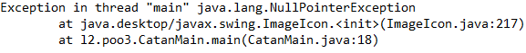
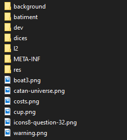

# **L2-Projet-POO3**

JAVA 10 minimum est requise

## Auteur

* Gargaun Illia Info 5
* Legrand Lilian Info 2 Info-Jap

## Compiler le programme

Se mettre dans le dossier “src/”, écrire une des deux commandes :

1. `javac -cp main/java/ -sourcepath main/resources/ -d classes main/java/l2/poo3/*.java main/java/l2/poo3/*/*.java main/java/l2/poo3/*/*/*.java`
2. `javac -cp main/java/ -sourcepath main/resources/ -d classes main/java/l2/poo3/*.java main/java/l2/poo3/controller/gui/*.java main/java/l2/poo3/controller/terminal/*.java main/java/l2/poo3/model/*.java main/java/l2/poo3/model/Enum/*.java main/java/l2/poo3/model/PlayerType/*.java main/java/l2/poo3/model/CaseType/*.java main/java/l2/poo3/Other/*.java main/java/l2/poo3/view/*.java main/java/l2/poo3/view/gui/*.java main/java/l2/poo3/view/terminal/*.java`

Pour obtenir un fichier .jar :

1. Se mettre dans le dossier “src/classes”
2. Copier le contenu du dossier “src/main/resources” dans le dossier “src/classes”
3. Ouvrir un terminal dans le dossier “src/classes”
4. Écrire la commande : `jar cvfm LesColonsDeCataneGroupe48.jar META-INF/MANIFEST.MF *`

## Lancer le programme
Pour lancer le programme vous avez plusieurs possibilités :

1. En doublant cliquant sur le fichier LesColonsDeCataneGroupe48.jar
2. En ouvrant un terminal dans le dossier contenant le fichier
   LesColonsDeCataneGroupe48.jar et en exécutant la commande
   `java -jar LesColonsDeCataneGroupe48.jar`
3. Si vous avez compilé vous-même le projet :
   1. Exécuté cette commande dans le terminal : `java -cp classes/l2.poo3.CatanMain`
   2. Si vous avez une erreur de type :
   3. Alors il faut que vous copier touts les fichiers et dossier qui se trouve dans le
      dossier "src\main\resources" vers le dossier "src\classes", vous devez obtenir le
      contenu suivant dans le dossier classes.

      

Dans tous les cas le programme vous demandera le type d’affichage, vous avez le choix entre l’affichage textuel et l’affichage graphique.

Vous pouvez directement lancer un de ces deux affichages en exécutant les commandes suivantes :
Pour l’affichage graphique :

1. `java -jar LesColonsDeCataneGroupe48.jar gui`
2. `java -jar LesColonsDeCataneGroupe48.jar graph`
3. `java -cp classes/ l2.poo3.CatanMain gui` (si vous avez compilé le code)
4. `java -cp classes/ l2.poo3.CatanMain graph` (si vous avez compilé le code)

Pour l’affichage textuel :

1. `java -jar LesColonsDeCataneGroupe48.jar text`
2. `java -jar LesColonsDeCataneGroupe48.jar terminal`
3. `java -cp classes/ l2.poo3.CatanMain text` (si vous avez compilé le code)
4. `java -cp classes/ l2.poo3.CatanMain terminal` (si vous avez compilé le code)

### **TODO List**

* Paramétrage du jeu:
  * [X]  Choisir le nombre de joueurs (3 ou 4)
  * [X]  Sélectionner “humain” ou “IA” pour chaque joueur
  * [X]  Choisir le mode d'affichage terminale ou gui
* Création du plateau
* L’utilisateur doit pouvoir:
  * [X]  Construire des routes, villes, cités
  * [X]  Acheter, stocker, utiliser les cartes spéciales de développement
  * [X]  Consulter ses ressources
  * [X]  Echanger des ressources via les ports
  * [X]  Gérer le personnage du voleur en cas de 7 aux dés
  * [X]  La route la plus longue (Fini +- l'algo à des problemes)
